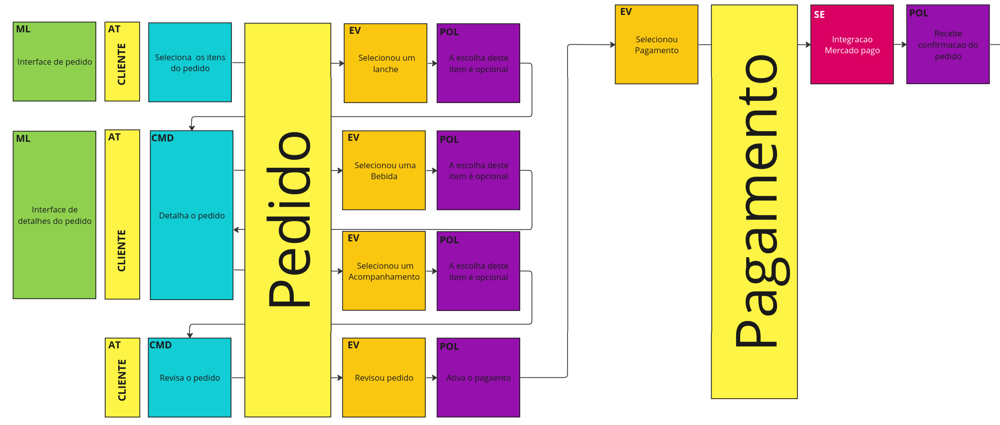
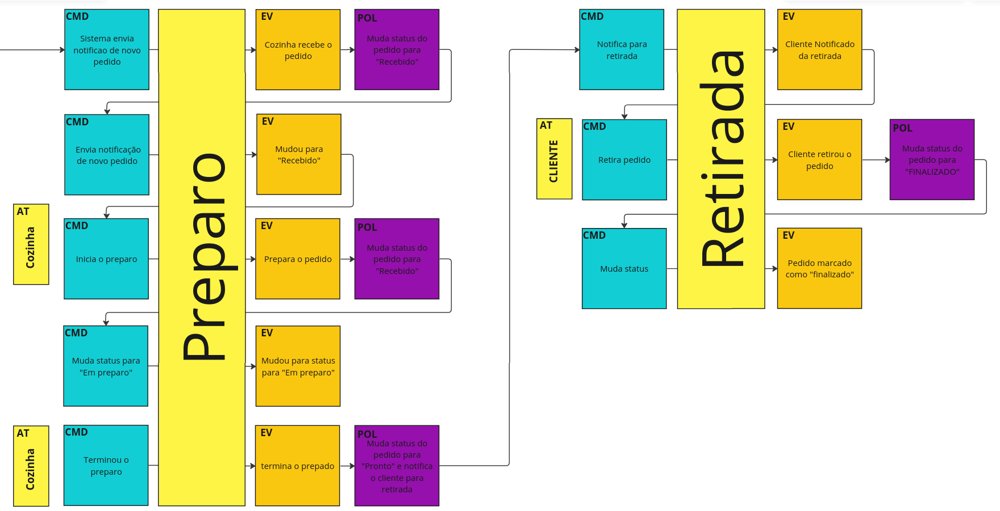

# Tech Challenge - Pós-Tech SOAT - FIAP

Este é o projeto desenvolvido durante a fase I e atualizado durante a fase II do curso de pós-graduação em arquitetura de software da FIAP - turma II/2023.

Repositório:
https://github.com/diorgeneseugenio/fiap-tech-challenge-soat/main

Membros do grupo:
Diórgenes Eugênio da Silveira - RM 349116
Elton de Andrade Rodrigues - RM 349353
Gabriel Mendes - RM 348989
Juliana Amoasei dos Reis - RM 348666


### Changelog Fase II:
- **[Estrutura do Projeto](#estrutura-do-projeto)**: Refatoração do projeto para utilizar conceitos do `clean architecture`;
- **[Kubernetes](#kubernetes)**: Adicionado deploy utilizando Kubernetes;
- **`/pedido/realizar-pedido/{id}`**: Atualizado endpoint para criar o checkout e retornar o pedido com a fatura para aguardar o pagamento;
- **Webhook - Confirmação de pagamento**: Adicionado o endpoint para alterar o status de pagamento(aprovado/reprovado);
- **`/pedido/`**: Atualizado endpoint para listar pedidos:
  1. Por Padrao agora ela retorna na regra de Pronto > Em Preparo > Recebido e não mosta as Finalizadas;
  2. Mantida a possibilidade de filtrar por usuário e/ou status:
      - Rascunho;
      - Aguardando pagamento;
      - Falha em gerar pedido (Pagamento reprovado);
      - Aguardando preparo (Pagamento aprovado);
      - Em preparo;
      - Pronto;
      - Entregue;

## Propósito do projeto

Fornecer um sistema para gerenciamento de pedidos para uma empresa do ramo de serviços de alimentação.

## Stack utilizada

* Node.js v18
* TypeScript 
* MySQL
* Express
* Sequelize
* Docker
* Kubernetes


## Instalação do projeto

Este projeto está pronto para ser executado em um ambiente Docker. Por este motivo, será necessária apenas a instalação do Docker e/ou Kubernetes, não sendo necessária a instalação manual do projeto. Também não será necessária a instalação manual do banco de dados (MySQL).

Caso não tenha o Docker instalado, siga as instruções para seu sistema operacional na [documentação oficial do Docker](https://docs.docker.com/get-docker/).

Para executar em ambiente de desenvolvimento:

* Faça o `fork` e `clone` este repositório em seu computador;
* Entre no diretório local onde o repositório foi clonado;

### Executar em ambiente Kubernetes

Os arquivos para o Kubernetes se encontram no diretório ```k8s/```:

1. Crie o secrets como o exemplo abaixo ou use um de terceiros com as envs listadas:

```yaml
apiVersion: v1
kind: Secret
metadata:
  name: fiap-tech-secrets
type: Opaque
data: # value = Base64
  db_username: dXNlcl90ZWNo
  db_password: dGVzdHRlc3Q=
  db_root_password: YWRtaW4xMjM=
  db_name: ZmlhcC1zb2F0LXByb2plY3RfZGI=
  jwt_secret: dTZCWTh3NHMzYXlHNjJvRzA1TVYxSE96eTllYm9UYVdoUWpIQ0ZpWmhjMjBFYlIwOGdzWlZPdUdQUGVVVUVJMg==
```

2. Execute o comando `kubectl apply -f <./caminho/do/arquivo/secret.yaml>` no diretório raiz do projeto para gerar os secrets;

3. Execute os comandos abaixo para subir as ferramentas do ambiente Kubernetes:

Banco de dados:
```
kubectl apply -f k8s/db/db.pvc.yaml
kubectl apply -f k8s/db/db.deployment.yaml
kubectl apply -f k8s/db/db.svc.yaml
```

API:
```
kubectl apply -f k8s/api/api.deployment.yaml
kubectl apply -f k8s/api/api.svc.yaml
```

A API estará pronta para receber requisições a partir da URL base http://localhost:30080/.
**OBS**: Caso a URL base não esteja disponível em `localhost`, execute o comando `minikube ip` no terminal e utilize o IP disponibilizado no lugar de `localhost`. Exemplo: `192.168.49.2:30080/api/produto`.


### Docker Compose

Utilize o comando `docker compose up` para "construir" (*build*) e subir o servidor local, expondo a porta 3000 em `localhost`. Além do container da `api` também subirá o serviço `db` com o banco de dados de desenvolvimento.

**IMPORTANTE:** Esta API está programada para ser acessada a partir de `http://localhost:3000` e o banco de dados utiliza a porta `3306`. Certifique-se de que não existam outros recursos ocupando as portas `3000` e `3306` antes de subir o projeto.

Para derrubar o serviço, execute o comando `docker compose down`.

## Utilizacao

Os projeto cria o metodo de pagamento no banco(QR Code) e as categorias padrão quando iniciado.

### Endpoints

Esta API fornece documentação no padrão OpenAPI.
Os endpoints disponíveis, suas descrições e dados necessários para requisição podem ser consultados e testados em ```/api-docs```.

O repositório do projeto também fornece uma coleção do Postman para testes em todos os endpoints.


### 1. Cadastrar Produtos

1.1 O projeto já cria as principais categorias(Lanche, Acompanhamento, Bebida, Sobremesa);
1.2 - Cadastro do produto:
```json
{
  "nome": "produto 1",
  "preco": 0.1,
  "descricao": "demo 1",
  "categoriaId": "1c941831-c8cb-43a3-8d3f-2959a6fb7241",
  "imagens": [
    {
      "url": "demo.png"
    }
  ]
}
```

### 2. Cliente 

1.1 - Cadastrar o cliente:
    É possível cadastrar o cliente com os dados de e-mail, nome e CPF. 
    **ATENÇÃO**: O e-mail e o CPF não podem estar cadastrado por outro usuário e o CPF deve ser um número válido. Utilize serviços de [geração de número válido de CPF](https://www.4devs.com.br/gerador_de_cpf) para os testes.

Com todos os dados:
Body:
```json
{
    "nome": "user_demo",
    "cpf": "269.289.330-11",
    "email": "test@test.com"
}
```

    Com apenas um dos identificadores:
Body:
```json
{
    "nome": "user_demo",
    "cpf": "269.289.330-11",
}
```
Body:
```json
{
    "nome": "user_demo",
    "email": "test@test.com"
}
```

Usuário Anônimo:
    Cria um usuário anônimo para esse atendimento e retorna o id
Body: null ou {}

### 3. Pedido

3.1 Crie um pedido vazio usando o ```/pedido/iniciar-pedido``` passando o id do usuário;
3.2 Adicione um produto ao pedido usando o ```/pedido/{id}/adicionar-item```;
  A lista de produtos pode ser consultada via GET ```/produto```
3.3 Finalize o pedido em ```/pedido/realizar-pedido/{id-pedido}``` passando o método de pagamento escolhido via body;
  No momento existe somente um método disponível, que pode ser consultado via GET ```/metodo-pagamento```
  Deve ser gerado um id de fatura para ser utilizado no pagamento
3.4 Use POST ```/pagamento``` para simular o funcionamento do webhook mudando o status de pagamento do pedido para aprovado ou reprovado

**OBS**: Todos os dados necessários para envio das requisições, via parâmetros ou body, estão disponíveis em ```/api-docs```.

### 4. Preparo
4.1 Utilize o ```/pedido/iniciar-preparo/``` para pegar o próximo pedido da fila ou passar o id para furar a fila;
4.2 Utilize o ```/pedido/finalizar-preparo/{id}``` para marcar como pronto;
4.3 Utilize o ```/pedido/entregar-pedido/{id}``` para marcar como finalizado;

## Desenvolvimento do projeto

### Diagramas de fluxo

Foram utilizadas técnicas de Domain Driven Design para definição dos fluxos:

- Realização do pedido e pagamento


- Preparação e entrega do pedido


- Diagrama com a separação dos contextos delimitados


### Dicionário

* Cliente: Usuário que faz o pedido;
* Produto: É o alimento cadastrado pelo estabelecimento que será disponibilizado para o cliente escolher.
* Categoria: A definição do tipo de Produto
* Pedido: Solicitação realizada pelo cliente que contém itens.
* Itens do Pedido: São os produtos selecionados pelo cliente, e são vinculados a um pedido.
* Cozinha: Equipe que prepara os produtos do pedido.
* Status do Pedido: Em que etapa do processo o pedido se encontra
* Fatura: Registro relativo ao faturamento do pedido, onde detalhamos o meio de pagamento usado.
* Pagamento: Realização do pagamento da fatura de um pedido.
* Status de Pagamento: Identifica o atual estado da fatura, com ele identificamos se o pagamento foi efetuado, ocorreu algum erro, ou ainda não foi processado o pagamento.

### Estrutura do Projeto

O projeto foi reestruturado seguindo o padrão do clean architecture. 

- `datasources`:  comunicação dos serviços externos como banco de dados e checkout;
- `domain`:  contém a camada de domínio da aplicação com suas entidades, casos de uso e repositórios;
- `interfaceAdapters`: camada de interface do clean architecture com o controlador;
- `presenters`: camada externa de comunicacao externa onde se entra a API;

```shell
.
└── src/
    ├── datasources/
    │   ├── database/
    │   └── paymentProvider/
    ├── domain/
    │   ├── entities/
    │   ├── repositories/
    │   └── useCases/
    ├── interfaceAdapters/
    │   └── controllers/
    └── presenters/
        └── api/

```

### Domain

Contém a camada de domínio da aplicação e as lógicas de negócio.

```shell
│   ├── domain
│   │   ├── entities
│   │   │   ├── types
│   │   │   │   ├── CategoriaType.ts
│   │   │   │   ├── CobrancaType.ts
│   │   │   │   ├── itensPedidoType.ts
│   │   │   │   ├── metodoPagamentoType.ts
│   │   │   │   ├── PagamentoType.ts
│   │   │   │   ├── pedidoService.type.ts
│   │   │   │   ├── pedidoType.ts
│   │   │   │   ├── produtoType.ts
│   │   │   │   └── UsuarioType.ts
│   │   │   ├── valueObjects
│   │   │   │   ├── cpf.ts
│   │   │   │   └── email.ts
│   │   │   ├── categoria.ts
│   │   │   ├── fatura.ts
│   │   │   ├── ImagemProduto.ts
│   │   │   ├── itemPedido.ts
│   │   │   ├── metodoDePagamento.ts
│   │   │   ├── Pagamento.ts
│   │   │   ├── pedido.ts
│   │   │   ├── produto.ts
│   │   │   └── usuario.ts
│   │   ├── repositories
│   │   │   ├── categoriaRepository.ts
│   │   │   ├── checkoutRepository.ts
│   │   │   ├── faturaRepository.ts
│   │   │   ├── metodoPagamentoRepository.ts
│   │   │   ├── pagamentoRepository.ts
│   │   │   ├── pedidoRepository.ts
│   │   │   ├── produtoRepository.ts
│   │   │   └── usuarioRepository.ts
│   │   └── useCases
│   │       ├── categoriaUseCase.ts
│   │       ├── faturaUseCase.ts
│   │       ├── metodoPagamentoUseCase.ts
│   │       ├── pagamentoUseCase.ts
│   │       ├── pedidoUseCase.ts
│   │       ├── produtoUseCase.ts
│   │       └── usuarioUseCase.ts

```

O diretório `domain` contém as entidades definidoras do negócio, como `usuario`, `pedido` e `categorias` e seus casos de uso. A interface entre a camada de domínio e o restante da aplicação foi definida através do uso de interfaces em `repositories`.

### datasources e presenters

```shell
├── src
│   ├── datasources
│   │   ├── database
│   │   │   ├── config
│   │   │   │   ├── interfaces
│   │   │   │   │   └── db.config.interface.ts
│   │   │   │   └── db.config.ts
│   │   │   ├── models
│   │   │   │   ├── categoriaModel.ts
│   │   │   │   ├── faturaModel.ts
│   │   │   │   ├── index.ts
│   │   │   │   ├── itemPedidoModel.ts
│   │   │   │   ├── metodoDePagamentoModel.ts
│   │   │   │   ├── pagamentoModel.ts
│   │   │   │   ├── pedidoModel.ts
│   │   │   │   ├── produtoImagensModel.ts
│   │   │   │   ├── produtoModel.ts
│   │   │   │   └── usuarioModel.ts
│   │   │   ├── repository
│   │   │   │   ├── categoriaDatabaseRepository.ts
│   │   │   │   ├── faturaDatabaseRepository.ts
│   │   │   │   ├── metodoPagamentoDatabaseRepository.ts
│   │   │   │   ├── pagamentoDatabaseRepository.ts
│   │   │   │   ├── pedidoDatabaseRepository.ts
│   │   │   │   ├── produtoDatabaseRepository.ts
│   │   │   │   └── usuarioDatabaseRepository.ts
│   │   │   └── seeders
│   │   │       ├── cria-categorias.ts
│   │   │       └── cria-metodo-de-pagamento.ts
│   │   └── paymentProvider
│   │       └── checkoutRepository.ts
│   ├── presenters
│   │   └── api
│   │       ├── config
│   │       │   ├── interfaces
│   │       │   │   └── server.config.interface.ts
│   │       │   └── server.config.ts
│   │       ├── routers
│   │       │   ├── schemas
│   │       │   │   ├── categoriaRouter.schema.ts
│   │       │   │   ├── metodoPagamentoRouter.schema.ts
│   │       │   │   ├── pagamentoRouter.schema.ts
│   │       │   │   ├── pedidoRouter.schema.ts
│   │       │   │   ├── produtoRouter.schema.ts
│   │       │   │   └── usuarioRouter.schema.ts
│   │       │   ├── categoriaRouter.ts
│   │       │   ├── index.ts
│   │       │   ├── metodoPagamentoRouter.ts
│   │       │   ├── pagamentoRouter.ts
│   │       │   ├── pedidoRouter.ts
│   │       │   ├── produtoRouter.ts
│   │       │   ├── usuarioRouter.ts
│   │       │   └── utils.ts
│   │       ├── index.ts
│   │       └── swaggerConfig.ts

```

O diretório `adapter/driver` da fase I foi substituído por `presenters/`, responsável por interagir com o core da aplicação, no nosso projeto respresentado pela API REST.
O diretório `adapter/driven` da fase I foi substituído por `datasources/`, responsável pela conexão com elementos externos ao core.
