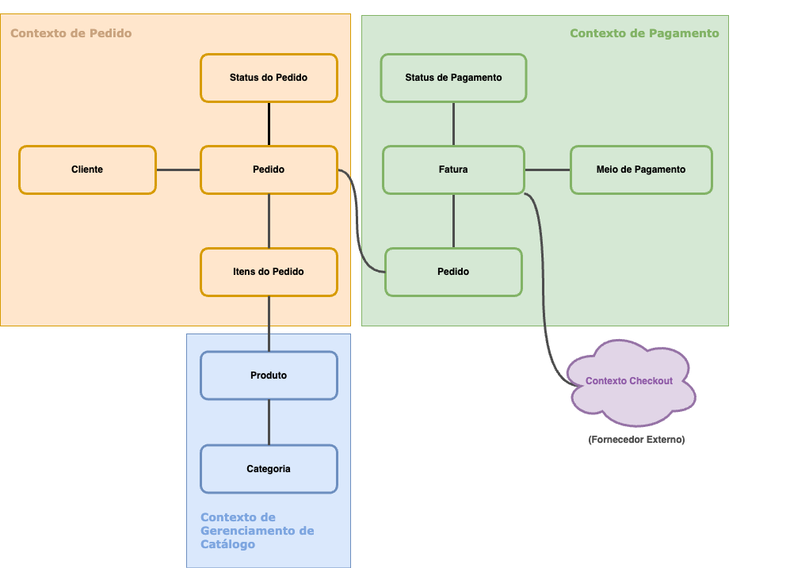

# Tech Challenge - Pós-Tech SOAT - FIAP

Este é o projeto desenvolvido durante a fase I do curso de pós-graduação em arquitetura de software da FIAP - turma II/2023.

Repositório:
https://github.com/diorgeneseugenio/fiap-tech-challenge-soat/main

Membros do grupo:
Diórgenes Eugênio da Silveira - RM 349116
Elton de Andrade Rodrigues - RM 349353
Gabriel Mendes - RM 348989
Juliana Amoasei dos Reis - RM 348666

## Propósito do projeto

Fornecer um sistema para gerenciamento de pedidos para uma empresa do ramo de serviços de alimentação.

## Stack utilizada

* Node.js v16
* TypeScript 
* MySQL
* Express
* Sequelize
* Docker


## Instalação do projeto

Este projeto está pronto para ser executado em um ambiente Docker. Por este motivo, será necessária apenas a instalação do Docker e ou Kubernetes, não sendo necessária a instalação manual do projeto. Também não será necessária a instalação manual do banco de dados (MySQL).

Caso não tenha o Docker instalado, siga as instruções para seu sistema operacional na [documentação oficial do Docker](https://docs.docker.com/get-docker/).

Para executar em ambiente de desenvolvimento:

* Faça o `fork` e `clone` este repositório em seu computador;
* Entre no diretório local onde o repositório foi clonado;

### Kubernetes

Os arquivos para o kubernetes se encontram no diretorio ```k8s/```:

Crie o secrets como o exemplo abaixo um de terceiros:

```yaml
apiVersion: v1
kind: Secret
metadata:
  name: fiap-tech-secrets
type: Opaque
data: # value = Base64
  db_username: {VALOR_BASE64}
  db_password: {VALOR_BASE64}
  db_root_password: {VALOR_BASE64}
  db_name: {VALOR_BASE64}
  jwt_secret: {VALOR_BASE64}
```


Banco de dados:
```
kubectl apply -f k8s/db/db.pvc.yaml
kubectl apply -f k8s/db/db.deployment.yaml
kubectl apply -f k8s/db/db.svc.yaml
```

API:
```
kubectl apply -f k8s/api/api.deployment.yaml
kubectl apply -f k8s/api/api.svc.yaml
```


### Docker Compose

Utilize o comando `docker compose up` para "construir" (*build*) e subir o servidor local, expondo a porta 3000 em `localhost`. Além do container da `api` também subirá o serviço `db` com o banco de dados de desenvolvimento.

**IMPORTANTE:** Esta API está programada para ser acessada a partir de `http://localhost:3000` e o banco de dados utiliza a porta `3306`. Certifique-se de que não existam outros recursos ocupando as portas `3000` e `3306` antes de subir o projeto.

Para derrubar o serviço, execute o comando `docker compose down`.

## Utilizacao

Os projeto cria o metodo de pagamento no banco(QR Code) e as categorias padroes quando iniciado.

### 1. Cadastrar Produtos

1.1 O projeto já cria as principais categorias(Lanche, Acompanhamento, Bebida, Sobremesa);
1.2 - Cadastro do produto:
```json
{
  "nome": "produto 1",
  "preco": 0.1,
  "descricao": "demo 1",
  "categoriaId": "1c941831-c8cb-43a3-8d3f-2959a6fb7241",
  "imagens": [
    {
      "url": "demo.png"
    }
  ]
}
```

### 2. Cliente 

1.1 - Cadastrar o cliente:
    É possível cadastrar o cliente com os dados de e-mail, nome e CPF. O e-mail e o CPF não podem estar cadastrado por outro usuário.

Com todos os dados:
Body:
```json
{
    "nome": "user_demo",
    "cpf": "269.289.330-11",
    "email": "test@test.com"
}
```

    Com apenas um dos identificadores:
Body:
```json
{
    "nome": "user_demo",
    "cpf": "269.289.330-11",
}
```
Body:
```json
{
    "nome": "user_demo",
    "email": "test@test.com"
}
```

Usuário Anonimo:
    Cria um usuário anonimo para esse atendimento e retorna o id
Body: null ou {}

### 3. Pedido

3.1 Crie um pedido vazio usando o ```/pedido/iniciar-pedido``` passando o id do usuário;
3.2 Adiciona produto ao pedido usando o ```/pedido/{id}/adicionar-item```;
3.2 Envia o pedido pro pagamento junto do metodo de pagamento(```/metodoPagamento```) e retorna o QR Code ```/pedido/realizar-pedido/{id}```(fake checkout muda o pedido para pago);

### 4. Preparo
4.1 Utilize o ```/pedido/iniciar-preparo/``` para pegar o próximo pedido da fila ou passar o id para furar a fila;
4.2 Utilize o ```/pedido/finalizar-preparo/{id}``` para marcar como pronto;
4.3 Utilize o ```/pedido/entregar-pedido/{id}``` para marcar como finalizado;

## Endpoints

Esta API fornece documentação no padrão OpenAPI.
Os endpoints disponíveis, suas descrições e dados necessários para requisição podem ser consultados e testados em http://localhost/3000/api-docs.

## Desenvolvimento do projeto

### Diagramas de fluxo

Foram utilizadas técnicas de Domain Driven Design para definição dos fluxos:

- Realização do pedido e pagamento


- Preparação e entrega do pedido


- Diagrama com a separação dos contextos delimitados


### Dicionário

* Cliente: Usuário que faz o pedido;
* Produto: É o alimento cadastrado pelo estabelecimento que será disponibilizado para o cliente escolher.
* Categoria: A definição do tipo de Produto
* Pedido: Solicitação realizada pelo cliente que contém itens.
* Itens do Pedido: São os produtos selecionados pelo cliente, e são vinculados a um pedido.
* Cozinha: Equipe que prepara os produtos do pedido.
* Status do Pedido: Em que etapa do processo o pedido se encontra
* Fatura: Registro relativo ao faturamento do pedido, onde detalhamos o meio de pagamento usado.
* Status de Pagamento: Identifica o atual estado da fatura, com ele identificamos se o pagamento foi efetuado, ocorreu algum erro, ou ainda não foi processado o pagamento.

### estrutura do projeto

O projeto foi estruturado seguindo o padrão de *ports & adapters*. O `core` contém a camada de domínio da aplicação, separada da infraestrutura, do gerenciamento dos bancos de dados (`driven`) e das interfaces da aplicação (`driver`).

```shell
.
└── src
    ├── adapter
    │   ├── driven
    │   │   └── infra
    │   │       ├── config
    │   │       │   └── interfaces
    │   │       ├── models
    │   │       ├── repository
    │   │       └── seeders
    │   └── driver
    │       └── api
    │           ├── config
    │           │   └── interfaces
    │           ├── controllers
    │           └── routers
    ├── core
    │   ├── applications
    │   │   ├── repositories
    │   │   └── services
    │   └── domain
    │       └── valueObjects
```

### Core

Contém a camada de domínio da aplicação e as lógicas de negócio.

```shell
 ├── core
 │   ├── applications
 │   │   ├── repositories
 │   │   │   ├── categoriaRepository.ts
 │   │   │   ├── produtoRepository.ts
 │   │   │   └── usuarioRepository.ts
 │   │   └── services
 │   │       ├── categoriaService.ts
 │   │       ├── produtoService.ts
 │   │       └── usuarioService.ts
 │   └── domain
 │       ├── categorias.ts
 │       ├── fatura.ts
 │       ├── itemPedido.ts
 │       ├── metodoDePagamento.ts
 │       ├── pedido.ts
 │       ├── produto.ts
 │       ├── usuarios.ts
 │       └── valueObjects
 │           ├── cpf.ts
 │           └── email.ts
```

O diretório `domain` contém as entidades definidoras do negócio, como `usuario`, `pedido` e `categorias`. Os atributos e métodos disponíveis para cada uma das entidades estão definidos no módulo `services` e a interface entre a camada de domínio e o restante da aplicação foi definida através do uso de interfaces em `repository`.

### adapter

```shell
 ├── adapter
 │   ├── driven
 │   │   └── infra
 │   │       ├── config
 │   │       │   ├── db.config.ts
 │   │       │   └── interfaces
 │   │       │       └── db.config.interface.ts
 │   │       ├── models
 │   │       │   ├── categoriaModel.ts
 │   │       │   ├── faturaModel.ts
 │   │       │   ├── index.ts
 │   │       │   ├── itemPedidoModel.ts
 │   │       │   ├── metodoDePagamentoModel.ts
 │   │       │   ├── pedidoModel.ts
 │   │       │   ├── produtoImagensModel.ts
 │   │       │   ├── produtoModel.ts
 │   │       │   └── usuarioModel.ts
 │   │       ├── repository
 │   │       │   ├── categoriaDatabaseRepository.ts
 │   │       │   ├── produtoDatabaseRepository.ts
 │   │       │   └── usuarioDatabaseRepository.ts
 │   │       └── seeders
 │   │           └── cria-categorias.ts
 │   └── driver
 │       └── api
 │           ├── config
 │           │   ├── interfaces
 │           │   │   └── server.config.interface.ts
 │           │   └── server.config.ts
 │           ├── controllers
 │           │   ├── categoriaController.ts
 │           │   ├── produtoController.ts
 │           │   └── usuarioController.ts
 │           └── routers
 │               ├── categoriaRouter.ts
 │               ├── index.ts
 │               ├── produtoRouter.ts
 │               └── usuarioRouter.ts
```

O diretório `adapter` contém as lógicas responsáveis pela interação do `core` da aplicação (regras de negócio e entidades).

O subdiretório `driven` é responsável pela conexão com elementos externos ao core. Este projeto utiliza este padrão para a conexão com a camada de dados através do uso do padrão `model` para definição de campos e tipos de dados de cada entidade.

O subdiretório `driver` é responsável por definir as interfaces que farão contato com os recursos externos definidos em `driven`. Neste projeto, o diretório `driver` define os pontos de contato através de uma API REST com rotas e controladores para gerenciamento de cada rota.
